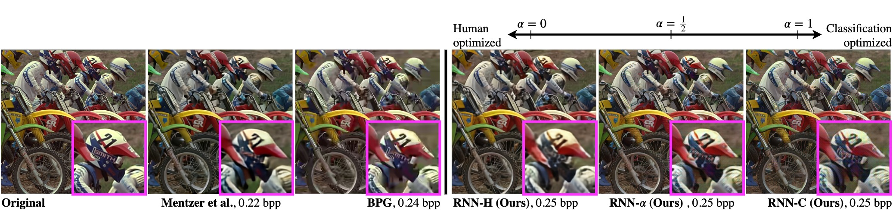

# Observer Dependent Lossy Image Compression

<div style="text-align: center">
  
</div>

## Requirements
- Python 3 (tested with versions 3.5.2 and 3.6.5)
- Tensorflow (tested with versions 1.8.0 and 1.9.0)
- other required python packages are specified in `requirements.txt`

### Checkpoints and pretrained models
Checkpoints for RNN compression are available for download [here](https://notawebsite). Extract them to `code/resources/trained_models/`.\
In order to prepare CNNs trained for ImageNet classification, run
````bash
cd code/
python prepare_keras_model.py --model CNN_MODEL
````   
where CNN Model is one of `densenet_121, inception_resnet_v2, inception_v3, mobilenet, resnet_50, vgg16, xception`. This 
will download the model weights if necessary, and subsequently freeze the graph as a .pb file to `code/resources/keras_models/`. 

## Compress and classify a sample image
To compress and classify an image, run the following command
```bash
cd code/
python eval_image.py --image /path/to/image_file --compression COMPPRESSION_METHOD --alpha ALPHA --quality Q_PARAM \
--classifier CLASSIFIER --show
```
where compression is specified with
- `COMPRESSION_METHOD` is one of `rnn`, `jpeg`, `webp` or `bpg`,
- `ALPHA` determines the degree of classification oriented compression - either `0`, `0.5` or `1.0` and
- `Q_PARAM` controls the compression rate; for RNN compression this must be an integer in 1, ..., 8; for BPG, JPEG and WEBP 
compression the usual parameters apply.

and the classifier is set via `CLASSIFIER` as one of
- `densenet_121, inception_resnet_v2, inception_v3, mobilenet, resnet_50, vgg16, xception`

## Downloading and prepraring image data
#### ILSVRC-2012
If you want to use ImageNet data, make sure you have an account with image-net.org and a username with access key. Then, go through the following steps:
1. Download the devkit from the official imagenet homepage and extract it to `code/resources/imagenet/meta/`. 
2. Download the ILSVRC2012 training and validation datasets, see e.g. the [download_imagenet.sh](https://github.com/tensorflow/models/blob/master/research/inception/inception/data/download_imagenet.sh) script provided by tensorflow.
3. Create tfrecords files with training and validation data by running the steps described above.

#### Stanford Dogs
1. Download the `Images` and `Lists` tar files from [here](http://vision.stanford.edu/aditya86/ImageNetDogs/)
2. Extract them both to the same folder (e.g. `~/data/stanford_dogs/`)

#### CUB-200-2011
1. Download the `All Images and Annotations` tar file from [here](http://www.vision.caltech.edu/visipedia/CUB-200-2011.html)
2. Extract to a folder (e.g. `~/data/cub200/`)

#### Store data in tfrecords files 
Throughout this repo we store data in tfrecords files, both for evaluation and training. Tfrecords files are generated 
using the script `code/create_data_records.py` for Stanford Dogs, CUB-200-2011 and ImageNet datasets. The following assumes 
that you have downloaded the necessary data to the right locations. Then, run the script as follows:
````bash
cd code/
python create_data_records.py --dataset DATASET --split SPLIT --data_dir /path/to/data/dir --target_dir /path/to/records
````
where `DATASET` is one of `imagenet`, `stanford_dogs`, `cub200` and `SPLIT` is either `train` or `val`. 

## Evaluate Accuracy and MS-SSIM on a dataset
You can evaluate accuracy and MS-SSIM on different datasets using one of the scripts `code/eval_accuracy.py` or `code/eval_hvs.py`. 
This assumes that you have trained models available and data stored as tfrecords files. The following is an example to evaluate accuracy on ImageNet compressed with RNNs:
```bash
cd code/
python eval_accuracy.py --dataset imagenet \
    --compression rnn \
    --records /path/to/records/ \
    --rnn_ckpt_dir /path/to/rnn/ckpt/
```


## Train your own models
#### Train RNN compression
I you want to train RNN compression, make sure you followed the previous steps and have the training data in the appropriate format. Note that if `ALPHA` > 0, you
will have to download VGG-16 weights from [here](https://github.com/machrisaa/tensorflow-vgg) first. Then run
```bash
cd code/
python train_compression.py --train_records /path/to/train_records/ \
                            --val_records /path/to/val_records/ \
                            --job_id JOB_ID \
                            --alpha ALPHA \
                            --config src/compression/rnn/configs/config.json \
                            --vgg_weights /path/to/vgg_weights.npy
```
where `JOB_ID` is an id for the training session and  `ALPHA` is a float in [0,1]. 


#### Train CNN classifiers for fine grained visual categorization
You can train your own classifiers for finegrained visual categorization using the scrip `code/train_classification.py`. 
It is possible to either train the models from scratch or initialize the feature extractor with imagenet weights. 
For the latter, you can download weights from tf slim [here](https://github.com/tensorflow/models/tree/master/research/slim) 
and extract the checkpoints to `code/resources/tf_slim_models`. The config files containing hyperparameters used in the 
paper are in `code/src/classification/fine_grained_categorization/training/configs/`.

The following is an example to finetune Incetpion-V3 on the Stanford Dogs dataset initializing the feature extractor with ImageNet weights and subsequently fine-tuning all layers:

```bash
cd code/
python train_classification.py --classifier inception_v3 \
    --dataset stanford_dogs \
    --train_records path/to/train_records/ \
    --val_records path/to/val_records/ \
    --job_id JOB_ID \
    --pretrained_model resources/tf_slim_models/inception_v3/inception_v3.ckpt
```
